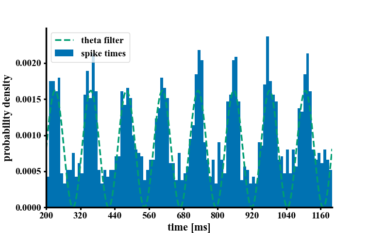
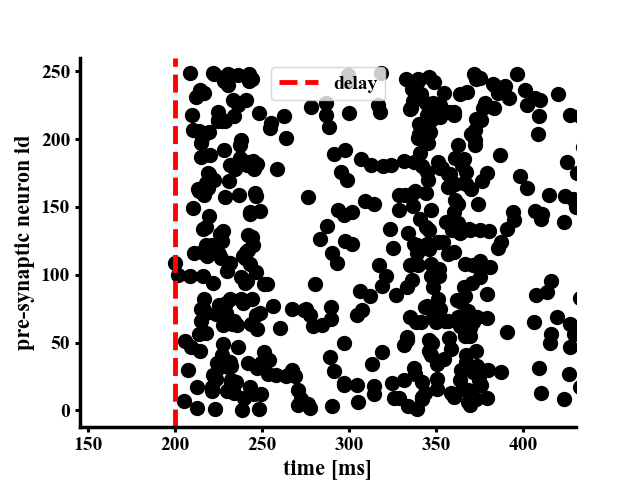

# Theta modulated Poisson distributed spike trains and Burst-like spike trains

To run the file execute the given python script.

Requirements: matplotlib, numpy

In case you do not have these packages, execute:

`pip install -r requirements.txt`

Recommendation: run under anaconda on a fresh environment.

```bash
	conda create --name myenv
	conda activate myenv
	conda install pip
	pip install -r requirements.txt
```


The parameters are:

```python
spikes = theta_filtered_spikes(rate,
                               nrun,
                               N,
                               time,
                               delay,
                               noise,
                               f_theta,
                               phi_theta,
                               save=True,
                               visualize=True)
```

Params:
- `rate`: The poisson distributed average firing rate in Hz.
- `nrun`: the number of run (trial).
- `N`: number of presynaptic artificial cells.
- `time`: total time of the simulation in ms.
- `delay`: delay for the stimulus to act in ms.
- `noise`: from 0 (deterministic) to 1. How much noise in the data set.
- `f_theta`: theta cycle frequency in Hz.
- `phi_theta`: theta cycle phase in radians.

```python
spikes = bursting_spikes(rate,
                         nrun,
                         N,
                         delay,
                         dt,
                         noise,
                         burst_num,
                         burst_len,
                         interburst,
                         save=True,
                         visualize=True)
```

Params:
- `rate`: The poisson distributed average firing rate in Hz.
- `nrun`: the number of run (trial).
- `N`: number of presynaptic artificial cells.
- `delay`: delay for the stimulus to act in ms.
- `noise`: from 0 (deterministic) to 1. How much noise in the data set.
- `burst_num`: number of bursts.
- `burst_len`: length of each burst in ms.
- `interburst`: length of inter-burst interval ms.
- `mode`: mode of burst len, either 'constant' or 'random'




<br>


