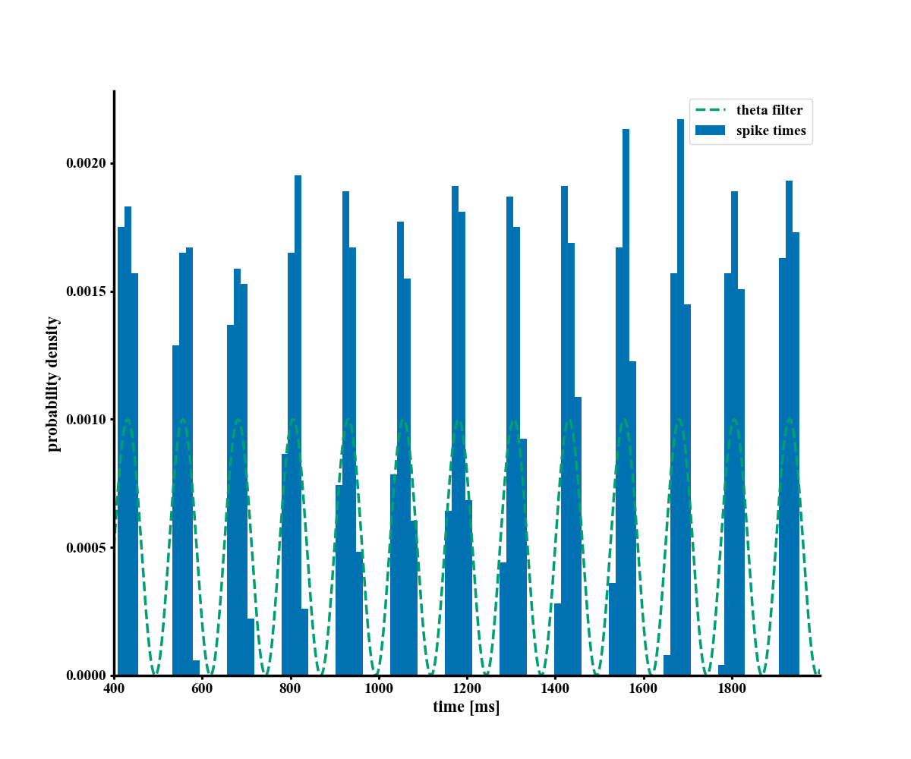

# Theta modulated Poisson distributed spike trains

To run the file execute the given python script.

Requirements: matplotlib, numpy, and [brian2](https://brian2.readthedocs.io/en/stable/)

In case you do not have these packages, execute:

`pip install -r requirements.txt`

Recommendation: run under anaconda on a fresh environment.

```bash
	conda create --name myenv
	conda activate myenv
	conda install pip
	pip install -r requirements.txt
```


The parameters are:

```python
spikes = theta_filtered_spikes(rate=12,
                               nrun=1,
                               N=1000,
                               time=2000,
                               delay=400,
                               noise=0.0,
                               f_theta=8,
                               phi_theta=0,
                               save=True,
                               visualize=True)
```

Params:
- `rate`: The poisson distributed average firing rate in Hz.
- `nrun`: the number of run (trial).
- `N`: number of presynaptic artificial cells.
- `time`: total time of the simulation in ms.
- `delay`: delay for the stimulus to act in ms.
- `noise`: from 0 (deterministic) to 1. How much noise in the data set.
- `f_theta`: theta cycle frequency in Hz.
- `phi_theta`: theta cycle phase in radians.




<br>


